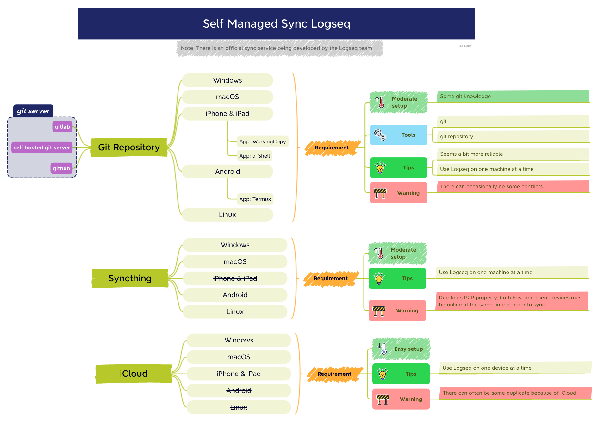

<h1 align="center">
    Logseq-Git-Sync-101
</h1>

    
    <a href="https://github.com/CharlesChiuGit/Logseq-Git-Sync-101/issues">
    
    
    

    
    

</a>

## Description

This repo aims to help Logseq users to sync their data via Git and GitHub.

        

## Why use Git + GitHub to sync Logseq graph?

      

<!-- <blockquote align="center"> -->
<!-- Self Managed Sync Diagram, by @danzu -->
<!-- </blockquote> -->

    <h6> Self Managed Sync Diagram, by @danzu</h6>

From the above diagram, it's pretty obvious that **Git** is the most robust way to sync your graph. iCloud is slow and problematic, and [Syncthing](https://syncthing.net/downloads/) is not available on iOS/iPadOS.

However, Git is quite scary for non-programmers, so this doc is here to help!

---

## 🎩 Suit up

Please check [Prerequisite](https://github.com/CharlesChiuGit/Logseq-Git-Sync-101/wiki/Prerequisite) and get yourself a cup of coffee ☕.

## 🤔 So how does this method work?

Please check [Workflow](https://github.com/CharlesChiuGit/Logseq-Git-Sync-101/wiki/%F0%9F%AA%9C-Workflow).

## Now you need another cup of coffee

###  For Windows users

Please check [Windows](https://github.com/CharlesChiuGit/Logseq-Git-Sync-101/wiki/For-Windows-users).

###  For macOS users

Please check [macOS](https://github.com/CharlesChiuGit/Logseq-Git-Sync-101/wiki/For-macOS-users).

###  For iOS/iPadOS users

Please check [iOS/iPadOS](https://github.com/CharlesChiuGit/Logseq-Git-Sync-101/wiki/For-iOS-iPadOS-users).

###  For Android users

Please check [Android](https://github.com/CharlesChiuGit/Logseq-Git-Sync-101/wiki/For-Android-users).

###  For Linux users

    
Linux users click here

If you are a Linux user, why are you still watching this repo? Shooo. 😎

Lol, just a joke. Take the steps in macOS section as reference if you need it.

## 💥 Omg, Something blows up

Please check [FAQ](https://github.com/CharlesChiuGit/Logseq-Git-Sync-101/wiki/%F0%9F%92%A5-FAQ).

---

## Change log

- 2023-12-27: Fix [For Android users](https://github.com/CharlesChiuGit/Logseq-Git-Sync-101/wiki/For-Android-users) `Termux` path to `~/storage/shared` to avoid issue#34.
- 2023-11-21: Update [For iOS/iPadOS users (Working-Copy)](https://github.com/CharlesChiuGit/Logseq-Git-Sync-101/wiki/For-iOS-iPadOS-users-(Working-Copy)) for updated version of Working Copy.
- 2023-10-21: Add deprecation warning at [For iOS/iPadOS users (a-Shell-Deprecated)](https://github.com/CharlesChiuGit/Logseq-Git-Sync-101/wiki/For-iOS-iPadOS-users-\(a-Shell,-Deprecated\))
- 2023-10-12: Add [Why and how to fix error: "fatal: not in a git directory"?](https://github.com/CharlesChiuGit/Logseq-Git-Sync-101/wiki/%F0%9F%92%A5-FAQ#why-and-how-to-fix-error-fatal-not-in-a-git-directory) to `FAQ`.
- 2023-01-09: Add `a-Shell` support for iOS/iPadOS users as a free althernative.
- 2022-11-01: Update `Prerequisite`, `For macOS users`, `For Android users`, `FAQ` wiki.

---

## 🪨 References

- [Working Copy on iOS](https://discord.com/channels/725182569297215569/766475028978991104/946787658405908560), by @danieltomasz[^1].
- [Steps to auto sync iOS + Windows](https://discord.com/channels/725182569297215569/924907384730689566/966343847934324776), by @Caps[^3].
- [Gitea - self-hosted git server](https://discord.com/channels/725182569297215569/924907384730689566/963840487712780320), by @Sawhney[^2].
- [Self Managed Sync + Android setup](https://discord.com/channels/725182569297215569/966983361249816586), by @danzu[^5] and @Abulafia[^4].
- [Git hooks settings](https://discord.com/channels/725182569297215569/960982172683100160)
- [What is GitHub?](https://kinsta.com/knowledgebase/what-is-github/)
- [How does Git work?](https://medium.com/@sahoosunilkumar/how-does-git-works-5cc8444ea383)
- [Repository size limits for GitHub.com](https://stackoverflow.com/questions/38768454/repository-size-limits-for-github-com)
- [About large files on GitHub](https://docs.github.com/en/repositories/working-with-files/managing-large-files/about-large-files-on-github)
- [Differences between CRLF and LF](https://violin-tao.blogspot.com/2016/05/crlflf-bug.html), in Chinese.
- [Alternative way of git syncing on iOS using a-shell for free](https://discuss.logseq.com/t/alternative-way-of-git-syncing-on-ios-using-a-shell-for-free/8570), by Petrus Hyvönen[^7].
- [[Tutorial] How to enable automatic logseq graph sync on iOS with git & shortcut](https://www.reddit.com/r/logseq/comments/105kqts/tutorial_how_to_enable_automatic_logseq_graph/), by @sickmz[^8].

## 🎉 Acknowledgment

Credits to @danieltomasz[^1], @Sawhney[^2], @Caps[^3], @Abulafia[^4] @qwxlea[^5] for the workflow build up. And credits to @danzu[^6] for the incredible diagram!

FYI, those IDs are IDs in [Logseq Discord Server](https://discord.gg/bZ2jF9taUg) if not specified.

[^1]: danieltomasz#5748
[^2]: Sawhney#7320
[^3]: Caps#0219
[^4]: Abulafia#3734
[^5]: qwxlea#3490
[^6]: danzu#6567
[^7]: https://discuss.logseq.com/u/Petrush
[^8]: https://github.com/sickmz
