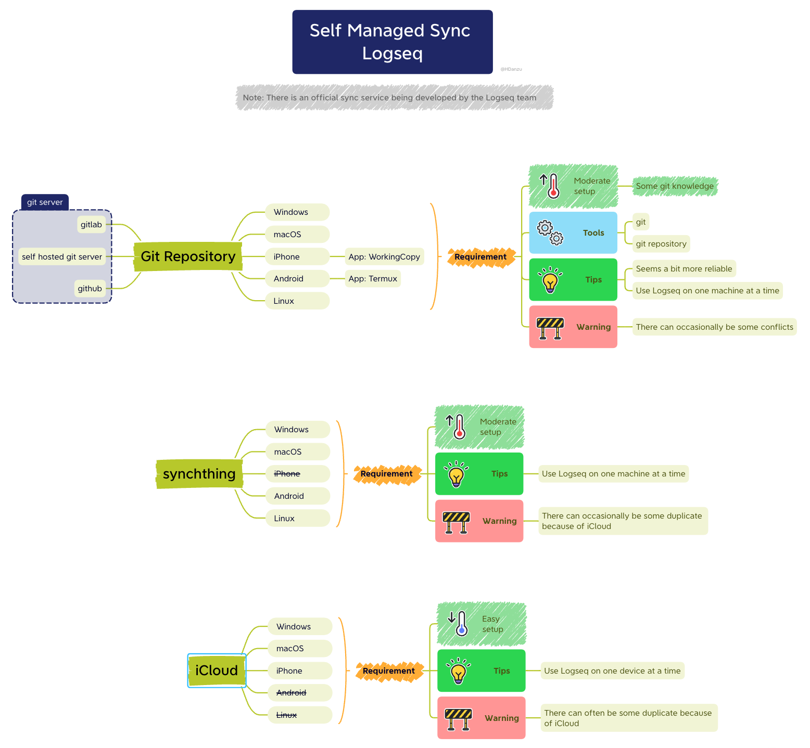

# Logseq-Git-Sync-101

## Description

This repo aims to help Logseq users to sync their data with Git and GitHub.

<p align="center">
        
</p>

## Credits

Credits to @danieltomasz[^1], @Sawhney[^2], @Caps[^3], @Abulafia[^4] @qwxlea[^5] for the workflow build up. And credits to @danzu[^6] for the incredicable diagram!

FYI, those IDs are IDs in [Logseq Discord Server](https://discord.gg/bZ2jF9taUg).

[^1]: danieltomasz#5748
[^2]: Sawhney#7320
[^3]: Caps#0219
[^4]: Abulafia#3734
[^5]: qwxlea#3490
[^6]: danzu#6567

---

## Why use Git + GitHub to sync Logseq graph?

### Self Managed Sync Diagram, by @danzu[^6]

<p align="center">
      
</p>

From the above diagram, it's pretty obvious that **Git** is the most robust way to sync your graph. iCloud is slow and problematic, and [Syncthing](https://syncthing.net/downloads/) is not available on iOS/iPadOS.

However, Git is quite scary for non-programmers, so this doc is here to help!

---

## Prerequisite

1. [GitHub](https://github.com/) account.
2. [Git](https://git-scm.com/downloads), for computer users.
3. [Working Copy](https://workingcopyapp.com/), for iOS/iPadOS users.
4. [Termux](https://termux.com/), for Andriod users.

<details>
    <summary>What is Git?</summary>
    Git is a free and open source distributed version control system created by Linus Torvalds in 2005.
</details>

<details>
    <summary>What is GitHub?</summary>
    GitHub is a for-profit company that offers a cloud-based Git repository hosting service. Essentially, it makes it a lot easier for individuals and teams to use Git for version control and collaboration.
</details>

<details>
<summary>How does Git works?</summary>
<p align="center">
  
</p>
<hr>
<p align="center">
  
</p>
</details>

## Limitations of GitHub

1. Recommend repositories remain small, ideally less than 1 GB, and less than 5 GB is strongly recommended.
2. GitHub blocks pushes that exceed 100 MB, and you will receive a warning form Git when you attempt to add or update a file larger than 50 MB.
3. Use [Git Large File Storage (Git LFS)](https://docs.github.com/en/repositories/working-with-files/managing-large-files/about-git-large-file-storage), if you really need to track those big files with Git.

## Things you should avoid

1. Open multiple instances of Logseq at a time, e.g. open Logseq on your computer and on your phone at the same time. This will cause conflict in your repo.
2. Put large files in `assets` folder, like images, videos, etc.

## Rejected push & Conflicts handling

#### What is Rejected push?

Rejected push happens when you make changes to the older version of your repo. You are not up-to-date.

#### What is Git Conflict?

Git Conflict happens when you have two commits modifying same line of the files.

#### Why do I need to know how to solve rejected push & Git conflict?

Rejected push and Git conflict are something every Git users will meet eventually. It's important to know how to solve them.

#### Case study

For example, You type "I'm faithful to Logseq." in your journal on your pc, but you also type "Na, I also use other note-taking tools." in your journal on your phone at the same time. GitHub will accept the first commit you push to it. But when you push the second commit, Git will say something like:

```bash
error: failed to push some refs to 'github.com:{your-username}/{your-reponame}.git'
hint: Updates were rejected because the tip of your current branch is behind
hint: its remote counterpart. Integrate the remote changes (e.g.
hint: 'git pull ...') before pushing again.
hint: See the 'Note about fast-forwards' in 'git push --help' for details.
```

which basicly means: "WTF Bruh, I can't believe you just lied to me. How can I trust you again?"

So you type `git pull` in your **Git Bash**/**iTerms**/**Termux** to gain GitHub's trust again, like what Git suggested in `hint:`. And that's how to resolve most of the `rejected push`.

However, sometimes that's not enough. After using `git pull` to update your local repo, Git will say:

```bash
Auto-merging {the conflict file} #e.g. journals/2022_04_23.md
CONFLICT (content): Merge conflict in {the conflict file}
Automatic merge failed; fix conflicts and then commit the result.
```

which means you have to manually delete which part you don't want.

So you open {the conflict file} with whatever text editor you like and fix it.

In the text editor:

```txt
<<<<<<< HEAD
- I’m faithful to Logseq. # Ok, I choose to keep this part.
=======
- Na, I also use other note-taking tools.
>>>>>>> 744f5cf94a46da43f5b318dab74c0f672bae31e2
```

After deletion:

```txt
- I’m faithful to Logseq.
```

Open Logseq and that let Logseq do the rest (Logseq will `commit` and `push`.) for you, and the `Git conflict` should be resolved. Now you should only see the chosen part remain in your GitHub repo. And you are again a happy Logseq user now! 😍

※ Noted: For  Android users, you have to manually `commit` and `push` the changes since [your workflow](https://github.com/CharlesChiuGit/Logseq-Git-Sync-101#android-termux-workflow) does not contain `git hooks` I provide.

※ Noted: Sometimes, it's the `logseq/metadata.edn` or `logseq/pages-metadata.edn` having Git conflits. This is trickier because you cannot tell easily which part is the one you need to keep. In this case I would suggest simply remove `logseq/metadata.edn` or `logseq/pages-metadata.edn` and do a `git pull` again, that will restore it from the one coming from GitHub. After pulling `logseq/metadata.edn` or `logseq/pages-metadata.edn` from GitHub, `Re-index` and `Refresh` Logseq are advised.

---

## Workflow

### Set up Git

This is like typing in the account/passward, so make sure you follow **ALL** the steps in [set-up-git](https://docs.github.com/en/get-started/quickstart/set-up-git).

※ Noted: `SSH-keys` is prefered to use in this workflow, **PLEASE** set it properly, **PLEASE**. [Connecting over SSH Section Link](https://docs.github.com/en/get-started/quickstart/set-up-git#connecting-over-ssh)

### Create a private repo

This is like creating a folder in GitHub, follow [create-a-repo](https://docs.github.com/en/get-started/quickstart/create-a-repo) to create a **private** repo.

※ Noted: If you create a **public** repo, that means everyone on GitHub can see what you put in there. You don't want that, do you?

### Add .gitignore in your repo (Optional)

In your repo page > Add file > Create new file > Name your file: `.gitignore`.
Type those:

```.gitignore
logseq/bak/
logseq/.recycle
```

### Download this repo

Click the green `Code` button and `Download ZIP`, then unzip it for later use.

###  For Windows users

After Git is set and a private repo is created:

1. Go to your local drive (for example: `D:\`) and right-click on it.
2. You should see `Git Bash Here`, click it.
3. Type `git clone git@github.com:{your-username}/{your-reponame}.git` and hit enter.
4. If it's your first time git clone something from GitHub, it will probably ask if you agree to authorized the connection, just type `Yes` and hit enter.
5. After it's done, you should see a new folder with your repo name.
6. Open the folder, there should have a hidden folder named `.git`.
7. Copy&paste the `post-commit` and `pre-commit` in `.git/hooks`.(Note: this folder could be hidden)
8. Open Logseq and add the folder with `.git` as your new graph.
9. Open Logseq > Settings > Version control > Enable Git auto commit.
10. Type something and wait few minutes to see if what you typed has also appear in GitHub.
11. If nothiong goes wrong, you are a happy Logseq user!

###  For MacOS users

After Git is set and a private repo is created:

1. Go to your local drive and right-click on it.
2. You should see `New Terminal at folder`, click it. If you don't see this option, check [this link](https://www.maketecheasier.com/launch-terminal-current-folder-mac/) to enable it.
3. Type `git clone git@github.com:{your-username}/{your-reponame}.git` and hit enter.
4. If it's your first time git clone something from GitHub, it will probably ask if you agree to authorized the connection, just type `Yes` and hit enter.
5. After it's done, you should see a new folder with your repo name.
6. Open the folder, there should have a hidden folder named `.git`.
7. Copy&paste the `post-commit` and `pre-commit` in `.git/hooks`.
8. Right click in `.git/hooks` and click `New Terminal at folder`, type

   ```bash
   chmod +x ./pre-commit && chmod +x ./post-commit
   ```

   to make those files executable by MacOS.

9. Open Logseq and add the folder with `.git` as your new graph.
10. Open Logseq > Settings > Version control > Enable Git auto commit.
11. Type something and wait few minutes to see if what you typed has also appear in GitHub.
12. If nothing goes wrong, you are a happy Logseq user!

###  For iOS/iPadOS users

1. Pay for the Pro version of the App `Working Copy`, it is cheap since you will never bother by iCloud crashing your Logseq anymore.
2. Open Working Copy > Seetings(⚙️) > Hosting Providers > Click `Test` > Sign-in to your GitHub account.
3. Open `Working Copy` > click `+` > Clone repository > Choose your repo.
4. When download is done, long-press on the repo > Share > Link Repository to Folder > My iPhone/iPad (I would suggest don't choose iCloud) > Logseq-icon folder > create a new sub-folder under the Logseq-icon one (I would suggest don't name the folder with the same name as your repo.) > click `Done`
5. Open `Logseq` and add new graph to that folder.
6. Open `ShortCuts` > Automation > Create Personal Automation:
   - On App Open:
     - `App` > choose `Logseq` > click `Next`
     - Search actions > `Pull Repository` - Repo: your Logseq repo
     - Turn off ask before running (or leave it on up to you)
   - On App Close:
     - `App` > choose `Logseq` > click `Next`
     - Search actions >
       - `Stage for Commit` - Path: `*`, Repo: your Logseq repo
       - `Commit Repository` - Repo: your Logseq repo, Message: `Auto-commit from iOS/iPadOS`
       - Noted: In `Commit Repository`, you can toggle off `Fail when nothing to Commit` if you find the failure notification annoying. Although I prefer to keep it toggle on to prevent empty commit and empty push.
       - `Push Repository` - Repo: your Logseq repo
     - Turn off ask before running (or leave it on up to you)
7. Type something and wait few minutes to see if what you typed has also appear in GitHub.
8. If nothiong goes wrong, you are a happy Logseq user!

※ Noted: If you are a student, you can sign up [github student pack](https://education.github.com/pack) and apply for free Working Copy Pro.

###  For Android users, by @Abulafia[^4]

#### Initial steps to install git and link it with logseq

1. Install `Termux` in Android, using the `F-droid` app. Follow instructions [here](https://wiki.termux.com/wiki/Installing_from_F-Droid)
2. Open Termux and type `pkg install git` to install git
3. Configure git username and email: `git config --global user.name "John Doe"` and `git config --global user.email johndoe@example.com` (this is the name and email which will go in commits, it can be anything, not related to your Github account)
4. In the termux terminal, create a folder for your graph, for example `cd documents; mkdir MyGraph` and clone your repo there with the command `git clone git@github.com:{your-username}/{your-reponame}.git ~/documents/MyGraph`
5. Open logseq and add a graph on that folder. Check that all looks ok.

#### Install shortcuts to synchronize the repository

1. Install `Termux:Widgets` from F-droid
2. In termux, enter folder `~/.shortucts` and edit a file named for example `pull-graph` containing:

   ```bash
   #!/usr/bin/bash
   source bin/source-ssh-agent
   cd {your repo location}  # eg: cd ~/documents/MyGraph
   git pull
   ```

   ※ Noted: If you use password-free private keys for git you don't need the `ssh-agent` line. You can include it to avoid typing the private key passphrase each time.

3. In the same `~/.shortcuts` folder create a second one named for example `pull-graph` contaning:

   ```bash
   #!/usr/bin/bash
   source bin/source-ssh-agent
   cd {your repo location}
   git add -A
   git commit -m "sync from android"
   git push
   ```

4. Add to the Android screen a widget for `Termux Widget` app, which will show the scripts available in `~/.shortcuts` (in our example, it will show pull-graph and push-graph). Taping on them, they will be executed by Termux.

#### Android-Termux-Workflow

- Tap "pull-graph" to download from github the most recent version of your graph
- Open Logseq and admire the latest version of your notes
- Edit/add notes, work on them
- Exit logseq and tap "push-graph" to upload your changes to github

###  For Linux users

<details>
    <summary>Linux users click here</summary>
    If you are a Linux user, why are you still watching this repo? Shooo. 😎
</details>

---

## References

- [Working Copy on iOS](https://discord.com/channels/725182569297215569/766475028978991104/946787658405908560), by @danieltomasz[^1].
- [Steps to auto sync iOS + Windows](https://discord.com/channels/725182569297215569/924907384730689566/966343847934324776), by @Caps[^3].
- [Gitea - self hosted git server](https://discord.com/channels/725182569297215569/924907384730689566/963840487712780320), by @Sawhney[^2].
- [Self Managed Sync + Android setup](https://discord.com/channels/725182569297215569/966983361249816586), by @danzu[^5] and @Abulafia[^4].
- [git hooks settings](https://discord.com/channels/725182569297215569/960982172683100160)
- [What is github?](https://kinsta.com/knowledgebase/what-is-github/)
- [How does Git work?](https://medium.com/@sahoosunilkumar/how-does-git-works-5cc8444ea383)
- [Repository size limits for GitHub.com](https://stackoverflow.com/questions/38768454/repository-size-limits-for-github-com)
- [About large files on GitHub](https://docs.github.com/en/repositories/working-with-files/managing-large-files/about-large-files-on-github)
